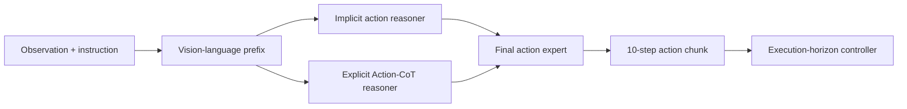

# LightAcotVLA

[](LICENSE)

LightAcotVLA is a research codebase focused on making action-space reasoning
faster, more selective, and easier to verify.

The current policy combines three components:

- **Explicit Action Reasoner (EAR):** produces a 15-frame coarse action plan.
- **Implicit Action Reasoner (IAR):** extracts latent action priors from the
  shared vision-language representation.
- **Final action expert:** consumes EAR and IAR features and generates a
  10-action control chunk.

The project studies where computation can be removed without hiding failures:
execution-horizon selection, Action-CoT denoising reduction, failure-focused
adaptation, and one-step EAR/final distillation.



> **Status snapshot: 2026-07-24.** The repository contains formal evaluations,
> diagnostic oracles, pilot training code, and the corresponding structured
> results. Not every pilot is a deployable improvement; evidence boundaries are
> stated explicitly below.

## Current progress

### 1. Execution Horizon V2-P

The execution-horizon line controls how many environment steps are executed
before the next expensive policy call. The formal comparison uses LIBERO-10,
10 tasks × 100 trials, seed 7, paired initial states, 10 Action-CoT denoising
steps, and real policy/server/RPC timing.

| Scheme | Success | Calls / episode | Avg. H | Policy s / episode | Interpretation |
| --- | ---: | ---: | ---: | ---: | --- |
| Paired H5 baseline | 92.7% | 63.518 | 5.000 | 5.687 | Seeded project baseline |
| Fixed H9 | 95.0% | 33.568 | 9.000 | 2.983 | Strongest simple efficiency reference |
| Exact batched-MC K20 | 94.4% | 34.647 | 8.846 | 4.230 | Analysis teacher; not deployable |
| V2-P distilled | 95.2% | 30.536 | 9.874 | 3.387 | Fewer calls, but predictor overhead remains |
| V2-P value-refined | 94.3% | 32.892 | 9.328 | 3.611 | No Pareto improvement over Fixed H9 |

The distilled selector mostly chooses H10. Its success point estimate is
slightly above Fixed H9, but its policy time per episode is higher. The current
evidence therefore does **not** establish a dynamic-selector Pareto win.
This table reports the project's seeded 100-trial-per-task protocol and should
not be compared directly with evaluations that use only 50 trials per task.

Evidence:

- [formal human-readable report](reports/execution_horizon_v2p_formal_10x100.md)
- [formal JSON/CSV outputs](results/execution_horizon_v2p/formal_10x100)
- [headroom, hard-state, RL, candidate, and progress diagnostics](results/execution_horizon_v2p/diagnostics)

### 2. Action-CoT compute reduction

Stage B separates two ideas that are easy to conflate:

1. changing or masking coarse Action-CoT values;
2. actually reducing the number of coarse flow denoising steps.

Only the second directly removes model computation in the current dense
architecture.

| Coarse denoising steps | Open-loop full ACoT latency | Reduction vs. 10 steps |
| ---: | ---: | ---: |
| 10 | 73.82 ms | 0.00% |
| 7 | 67.42 ms | 8.67% |
| 5 | 63.23 ms | 14.35% |
| 3 | 60.32 ms | 18.29% |
| 1 | 57.10 ms | 22.65% |

These are open-loop timing results. Token pruning or cached overrides that
still execute the same dense expert do not provide the same compute saving,
and closed-loop quality must be evaluated separately. The table varies coarse
NFE while final-action denoising remains fixed at 10 steps.

Evidence: [Stage B results](results/stage_b).

### 3. Task8/9 failure-focused adaptation

Task8 and Task9 are the main failure-focused testbed. The repository includes
targeted SFT, a uniform continued-SFT control, hard-state DAgger collection,
and held-out Fixed H9 evaluation.

| Checkpoint / protocol | Episodes | Success |
| --- | ---: | ---: |
| Targeted SFT 1k, initial 20 roots per task | 40 | 80.0% |
| Uniform control 1k, same initial roots | 40 | 95.0% |
| Uniform control 1k, episodes 20–99 | 160 | 91.25% |
| Base 50999, 25 unseen roots × 2 policy-seed rounds/task | 100 | 89.0% |
| DAgger 1k, same roots and policy-seed rounds | 100 | 91.0% |

The targeted SFT pilot regressed on its paired initial set relative to the
uniform control. Round-1 hard-state collection accepted only 3 corrective
trajectories (705 frames, 2 roots) from 33 attempted hard roots. The DAgger 1k
checkpoint had 8 rescues and 6 regressions relative to base
(McNemar p=0.7905): the two policy-seed halves were net -1 and +3. It therefore
did not pass the preset continuation gate and is not a stable improvement.

Evidence: [Task8/9 adaptation results](results/task89_adaptation).

### 4. IR-ACoT one-step pilot

IR-ACoT tests a different speedup axis: distill the original 10-step EAR and
10-step final flow into one-step students while keeping the VLM, IAR, and
reasoning fusion frozen. `IR-lite` adds an intervention-response loss;
`B6-lite` is the matched clean endpoint control with the same deployed graph.

Completed:

- a 200-state open-loop EAR intervention audit;
- 2,000 clean teacher endpoint exports;
- 300-step one-step EAR training;
- 2,000 one-step student-EAR exports;
- 2,000 teacher-final relabels conditioned on those student EARs;
- 300-step B6-lite and IR-lite final-student training.

The causal audit passed because the final action responded strongly to EAR
rotation and partly to translation. This is an open-loop sensitivity result,
not a success-rate result.

| Final 300-step checkpoint | Validation final MSE | Validation IR-delta MSE | IR-delta cosine |
| --- | ---: | ---: | ---: |
| B6-lite | 0.003643 | 0.000309 | 0.502 |
| IR-lite | 0.003630 | 0.000311 | 0.496 |

At the final checkpoint, IR-lite has not demonstrated a response-alignment
advantage over the matched B6-lite control. Closed-loop LIBERO success and real
one-step staged latency have not yet been evaluated, so no method-quality or
end-to-end speedup claim is made.

Evidence:

- [pilot protocol](docs/ir_acot_mvp.md)
- [pilot summaries and metric streams](results/ir_acot_pilot)

## Evidence map

| Path | Purpose |
| --- | --- |
| [`reports/context/experiment_log.md`](reports/context/experiment_log.md) | Append-only factual project ledger; about 480 KB at this snapshot |
| [`reports/README.md`](reports/README.md) | Report and result index |
| [`results/execution_horizon_v2p`](results/execution_horizon_v2p) | Formal V2-P results and diagnostics |
| [`results/stage_b`](results/stage_b) | Action-CoT pruning, denoising, timing, and closed-loop summaries |
| [`results/task89_adaptation`](results/task89_adaptation) | Targeted SFT, uniform control, and DAgger data |
| [`results/ir_acot_pilot`](results/ir_acot_pilot) | One-step EAR/final training and audit data |

Presentation files, checkpoints, HDF5 shards, videos, raw per-step rollouts,
full training logs, environments, and caches are intentionally not tracked.

## Main implementation areas

| Area | Main files |
| --- | --- |
| Core policy model and profiling | `src/openpi/models/acot_vla.py`, `src/openpi/policies/policy.py` |
| Execution-horizon predictor | `src/openpi/models/execution_horizon_predictor.py`, `src/openpi/execution_horizon/` |
| V2-P evaluation and training | `scripts/eval_libero_execution_horizon.py`, `scripts/train_execution_horizon_predictor.py` |
| Headroom and selector diagnostics | `scripts/audit_execution_horizon_headroom.py`, `scripts/audit_execution_horizon_selector_eval.py` |
| Stage B pruning and NFE sweeps | `scripts/eval_libero_action_cot_pruning.py`, `scripts/sweep_action_cot_denoising_steps.py` |
| Hard-state DAgger | `scripts/collect_libero_hard_state_dagger.py` |
| IR-ACoT endpoint distillation | `src/openpi/action_cot/endpoint_dataset.py`, `scripts/audit_ear_interventions.py`, `scripts/train_acot_endpoint_distillation.py` |

New evaluation and sidecar paths are optional. Ordinary training, serving, and
evaluation behavior remains unchanged unless the corresponding flags are used.

## Getting started

### Installation

The project uses `uv` for dependency management.

```bash
git clone https://github.com/KongyueX/LightAcotVLA.git
cd LightAcotVLA
git submodule update --init --recursive
GIT_LFS_SKIP_SMUDGE=1 uv sync
GIT_LFS_SKIP_SMUDGE=1 uv pip install -e .
```

### Base training and serving

```bash
# Convert LIBERO data to LeRobot format.
python examples/libero/convert_libero_data_to_lerobot.py

# Compute normalization statistics.
uv run scripts/compute_norm_stats.py --config-name <CONFIG_NAME>

# Train and serve.
bash scripts/train.sh <CONFIG_NAME> <EXP_NAME>
bash scripts/server.sh <GPU_ID> <PORT>
```

### Experiment entry points

```bash
uv run python scripts/eval_libero_execution_horizon.py --help
uv run python scripts/eval_libero_action_cot_pruning.py --help
uv run python scripts/collect_libero_hard_state_dagger.py --help
uv run python scripts/audit_ear_interventions.py --help
uv run python scripts/train_acot_endpoint_distillation.py --help
```

The IR-ACoT server workflow is documented in
[`docs/ir_acot_mvp.md`](docs/ir_acot_mvp.md).

## Next gates

1. Evaluate original 10×10, untrained 1×1, B6-lite 1×1, and IR-lite 1×1
   under the same Fixed H9 closed-loop protocol and measure staged latency.
2. Continue IR-ACoT only if it improves the success/latency Pareto point over
   B6-lite; open-loop reconstruction alone is insufficient.
3. Do not repeat the same global DAgger recipe unchanged; first improve
   correction coverage or add state-selective recovery, then compare across
   multiple policy seeds.
4. Keep Fixed H9 as the execution-horizon efficiency reference; add selector
   complexity only when held-out rescues exceed regressions at comparable
   policy time.

## License and third-party notices

LightAcotVLA is distributed under the [Apache License 2.0](LICENSE). The
repository contains modified third-party open-source components; source
provenance and license notices are recorded in
[THIRD_PARTY_NOTICES.md](THIRD_PARTY_NOTICES.md).
